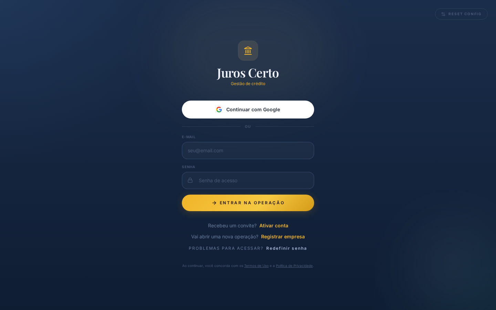
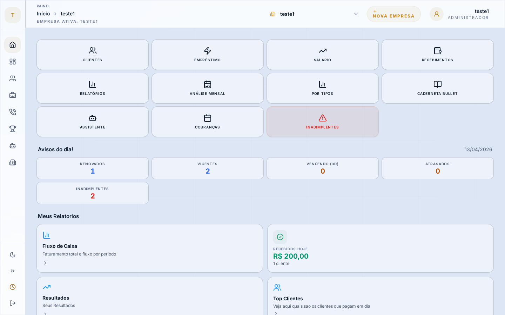
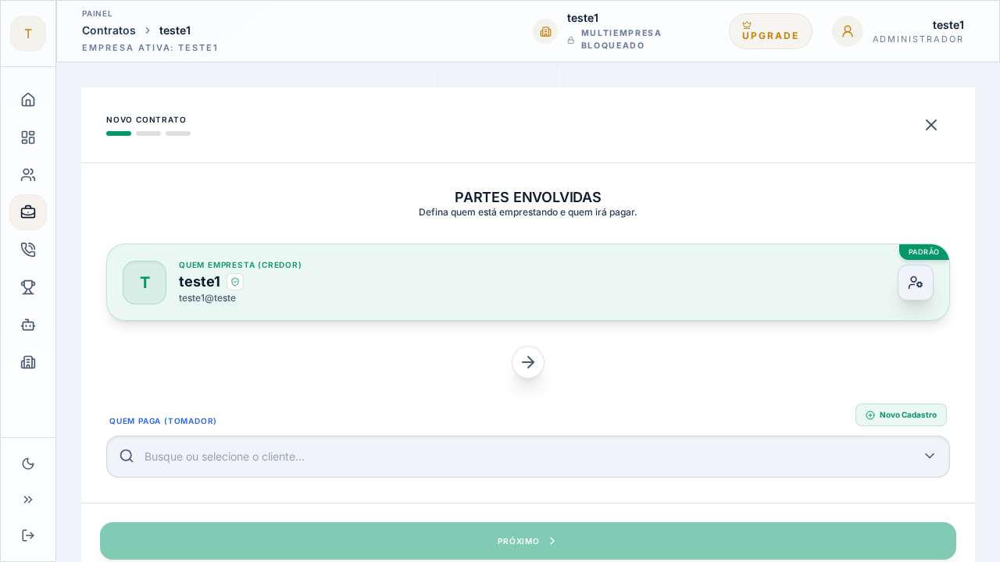

<div align="center">

<br/>


# Juros Certo — Gestão de Crédito operada por um Agente de IA no WhatsApp

**SaaS multi-tenant** para gestão de carteiras de crédito privado, operável por inteiro através de um **agente de IA conversacional no WhatsApp** — que cadastra contratos e clientes, dá baixa em pagamentos e dispara lembretes automáticos de manhã e à tarde — somado a um painel web completo (PIX nativo, inadimplência, multi-CNPJ).

<br/>

[](https://react.dev)
[](https://typescriptlang.org)
[](https://supabase.com)
[](https://vitejs.dev)
[](https://tailwindcss.com)
[](https://cloud.google.com/run)
[](https://ai.google.dev)
[](#-agente-de-ia-no-whatsapp)
[](https://nodejs.org)

<br/>

</div>

---

## Visão Geral

O **Juros Certo** resolve um problema real de gestores de carteiras de crédito privado: controlar múltiplos contratos, parcelas, pagamentos e inadimplências em um único lugar, acessível tanto pelo painel web quanto pelo WhatsApp ou Telegram via linguagem natural.

> Plataforma pensada para o mercado brasileiro: cálculo de juros compostos, PIX nativo, multi-CNPJ e suporte completo a PT-BR.

---

## 🤖 Agente de IA no WhatsApp

> O coração do Juros Certo. Um **agente de IA conversacional** que opera a carteira inteira por **linguagem natural** no WhatsApp — o gestor administra contratos, cobranças e pagamentos sem nunca abrir o painel.

| Capacidade | Como o gestor usa (texto ou áudio) |
|------------|-----------------------------------|
| 📝 **Cadastra contratos e clientes** | *"cria contrato de 5 mil pra Maria, 12x, 3% ao mês"* |
| ✅ **Dá baixa em pagamentos** | *"baixar parcela do João"* → gera comprovante em PNG |
| 🔔 **Lembretes automáticos de manhã e à tarde** | briefing matinal dos vencimentos do dia + follow-up de cobrança no fim do dia (Cloud Scheduler) |
| 💬 **Responde consultas em PT-BR** | *"quem vence essa semana?"*, *"extrato do João?"* |
| 🎙️ **Entende mensagens de voz** | transcrição de áudio via Gemini |
| 🛡️ **Confirma antes de agir** | confirmação explícita + *policy-engine* antes de qualquer mutação de dados |

**Como funciona por baixo:** um pipeline de **NLU de 20 estágios** em **Node.js + Express**, com um *intent-router* de 80+ regex (~100ms) e *fallback* para o **Google Gemini** quando a confiança é baixa (<500ms). Integração com WhatsApp via **UazAPI** (e Telegram), rodando no **Google Cloud Run** — `webhook → dedup → rate-limit → buffer → session → prompt-guard → áudio → intent-router → action-planner → policy-engine → tool-executor → response-generator`.

```
WhatsApp ─▶ Webhook ─▶ Pipeline NLU (20 estágios) ─▶ Ação confirmada ─▶ Supabase (RLS por tenant)
   ▲                         │
   └──── resposta em PT-BR ◀─┘     ⏰ Cloud Scheduler ─▶ lembretes (manhã + tarde)
```

---

## Screenshots

### Login


*Tela de acesso com autenticação por e-mail/senha ou Google.*

### Painel Admin — Dashboard


*Visão geral com métricas de contratos vigentes, vencimentos próximos, inadimplências e avisos do dia.*

### Wizard de Criação de Contrato


*Criação guiada de contratos em 3 etapas: partes envolvidas, condições financeiras e resumo.*

---

## Funcionalidades

### Painel Web (Admin)
- **Gestão de Contratos** — Criação com juros compostos, wizard 3 etapas, investidor → devedor
- **Controle de Parcelas** — Status `pendente | pago | atrasado | parcial` com cálculo automático de multa e juros de mora
- **PIX Nativo** — Geração de QR Code e string PIX (padrão Banco Central) com um clique
- **Recibos em PNG** — Download de comprovante de pagamento para envio ao cliente
- **Dashboard de Inadimplência** — Ranking de devedores, alertas de vencimento, cobrança integrada
- **Renegociação de Contratos** — Renovação, reestruturação e quitação antecipada
- **Multi-empresa** — Um tenant pode operar múltiplos CNPJs com segregação total de dados via RLS

### Bot Conversacional (WhatsApp + Telegram)
- Consultas em linguagem natural: *"quem vence essa semana?"*, *"extrato do João?"*
- Criação de contratos por texto/voz: *"cria contrato de 5 mil pra Maria, 12x, 3% ao mês"*
- Confirmação explícita antes de qualquer mutação de dados
- Lembretes automáticos de manhã (briefing dos vencimentos) e à tarde (follow-up de cobrança) via Cloud Scheduler
- Transcrição de áudio via Gemini (suporte a mensagens de voz no WhatsApp)

### Análise com IA
- Narrativa de portfólio gerada pelo Gemini: pontos fortes, riscos e recomendações
- NLU híbrido: 80+ regex (~100ms) com fallback para Gemini quando a confiança é baixa (<500ms)

---

## Arquitetura

```
┌──────────────────────────────────────────────────────────────┐
│                      Painel Web (React 19)                    │
│   Login → Dashboard → [Admin | Investidor | Devedor]          │
│   AdminContracts · InvestorDashboard · DebtorDashboard        │
└──────────────────────────┬───────────────────────────────────┘
                           │ Supabase JS Client
               ┌───────────▼───────────┐
               │  Supabase (Postgres)   │
               │  RLS por tenant/empresa│
               │  Auth · Storage · Edge │
               └───────────┬───────────┘
                           │
┌──────────────────────────▼───────────────────────────────────┐
│                     E-Finance Bot (Node.js)                   │
│   WhatsApp/Telegram → Webhook → Pipeline NLU (20 estágios)   │
│                                                               │
│   inbound-buffer (debounce 3.5s)                             │
│   → intent-router (80+ regex) → Gemini fallback              │
│   → action-planner → tool-executor → response-generator      │
└──────────────────────────────────────────────────────────────┘
```

### Pipeline NLU do Bot — 20 Estágios

```
Webhook → dedup → rate-limit → inbound-buffer
  → session-manager → prompt-guard → audio-pipeline
  → confirmation-store → followup-resolver → command-understanding
  → intent-router → intent-classifier → action-planner → policy-engine
  → tool-executor → response-generator → canal (WhatsApp / Telegram)
```

---

## Stack

| Camada | Tecnologias |
|--------|-------------|
| **Frontend** | React 19, TypeScript, Vite, Tailwind CSS, Recharts, Lucide |
| **Backend** | Supabase — PostgreSQL, Row Level Security, Auth, Edge Functions |
| **Bot** | Node.js + Express, Gemini API, UazAPI (WhatsApp), Telegram Bot API |
| **IA** | Google Gemini — NLU fallback, análise de portfólio, transcrição de áudio |
| **Pagamentos** | PIX (padrão Banco Central) — geração de QR Code nativa |
| **Deploy** | Google Cloud Run (Docker multi-stage), Artifact Registry, Secret Manager |
| **CI/CD** | GitHub Actions — build, testes E2E (Playwright) e deploy automático |

---

## Modelo de Dados

```
Tenant ──┬── Company (CNPJ)
         │     ├── Profile           role: admin | investor | debtor
         │     ├── Investment        contrato: investidor → devedor
         │     │     └── LoanInstallment   parcelas + multas + mora
         │     ├── Invite            código de onboarding
         │     ├── ContractRenegotiation
         │     └── AvulsoPayment
         └── BotSession · BotConfig
```

Row Level Security garante isolamento total entre tenants — e, no modelo multi-empresa, entre CNPJs do mesmo tenant.

---

## Como Rodar Localmente

**Pré-requisitos:** Node.js 18+, conta Supabase (free tier)

```bash
# 1. Clonar e instalar
git clone https://github.com/Gsfrota/e-finance.git
cd e-finance
npm install

# 2. Configurar variáveis de ambiente
cp .env.example .env.local
# Preencher: VITE_SUPABASE_URL, VITE_SUPABASE_ANON_KEY, GEMINI_API_KEY

# 3. Criar schema no Supabase
# Executar o SQL em context/database_schema.md no Supabase SQL Editor

# 4. Rodar
npm run dev      # http://localhost:3000
npm run build    # build de produção
```

**Bot (opcional):**

```bash
cd e-finance-bot
npm install
# Configurar .env com SUPABASE_URL, SUPABASE_SERVICE_ROLE_KEY,
#   GEMINI_API_KEY, UAZAPI_INSTANCE_TOKEN, TELEGRAM_BOT_TOKEN
npm run dev
```

---

## Deploy

Produção roda no **Google Cloud Run** via Docker multi-stage (Node 22 builder → nginx alpine).

```bash
./deploy.sh              # painel web
./e-finance-bot/deploy-bot.sh  # bot
```

Secrets gerenciados pelo **Google Secret Manager**. Nenhuma credencial no código ou no repositório.

---

## Arquitetura de Testes

Testes E2E com **Playwright**, cobrindo os três roles da plataforma e os fluxos críticos de negócio.

### Pré-requisitos

```bash
npm run preview          # servidor na porta 4173 (obrigatório)
# Variáveis em .env.local: TEST_ADMIN_EMAIL/PASSWORD, TEST_INVESTOR_EMAIL/PASSWORD, TEST_DEBTOR_EMAIL/PASSWORD
```

### Comandos

```bash
npm run test:e2e          # todos os testes (headless)
npm run test:e2e:ui       # UI interativa do Playwright
npm run test:e2e:headed   # browser visível
npm run test:e2e:report   # relatório do último run
npm run test:qa           # smoke tests pré-deploy
```

### Organização (`e2e/`)

| Diretório | Escopo |
|-----------|--------|
| `auth/` | Login, isolamento entre roles |
| `admin/` | Dashboard, contratos, usuários, multi-tenant, yield |
| `investor/` | Dashboard do investidor |
| `debtor/` | Dashboard do devedor |
| `payment/` | PIX, boleto, parcelado, quitação, surplus, histórico |
| `contract/` | Criação, ciclo de vida, validação |
| `reports/` | KPIs, relatórios mensais, caderneta, recibos |
| `system/` | Planos de assinatura, regras de sistema |
| `e2e-full/` | Flows integrados ponta a ponta |

### Autenticação

`e2e/auth.setup.ts` faz login para cada role e persiste o estado em `e2e/.auth/{role}.json`. O setup também grava o `EF_ACTIVE_COMPANY_SCOPE` no `localStorage` para garantir que o scope de empresa ativa esteja correto antes de salvar o estado — sem isso, views com `companyId` falham por retornar scope agregado.

---

## Estrutura do Projeto

```
e-finance/
├── components/          # UI (React) — Login, Dashboard, contratos, modais
├── hooks/               # Data fetching — useInvestorMetrics, useDebtorFinance
├── services/
│   ├── supabase.ts      # Cliente + helpers (parseSupabaseError, isValidCPF)
│   ├── gemini.ts        # Google GenAI — análise de portfólio
│   └── pix.ts           # Geração de strings PIX
├── types.ts             # Tipos globais TypeScript
├── e-finance-bot/       # Bot WhatsApp/Telegram
│   └── src/
│       ├── ai/          # NLU: intent-router, classifier, response-generator
│       ├── assistant/   # action-planner, tool-executor, policy-engine
│       ├── actions/     # Lógica de negócio (~1.850 linhas)
│       ├── channels/    # UazAPI (WhatsApp) + Telegram
│       └── scheduler/   # Briefing matinal (Cloud Scheduler)
└── Dockerfile
```

---

## Roles e Acessos

| Role | Capacidades |
|------|-------------|
| **admin** | Gerencia contratos, usuários, empresas; acessa todos os módulos |
| **investor** | Visualiza carteira própria, retornos e parcelas a receber |
| **devedor** | Vê saldo, parcelas pendentes e gera QR PIX para pagamento |
| **bot** | Processa mensagens; só executa mutações após confirmação explícita |

---

## Licença

Projeto privado — portfólio pessoal.

---

<div align="center">
  <sub>Desenvolvido com React 19 · Supabase · Google Cloud Run · Gemini AI</sub>
</div>
